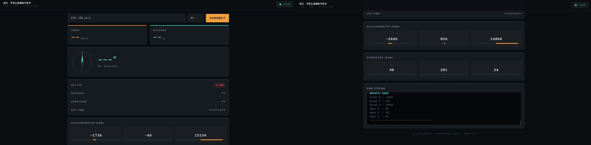
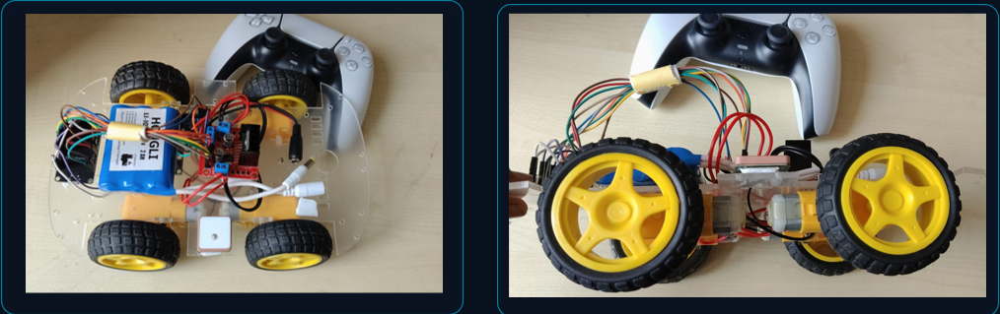
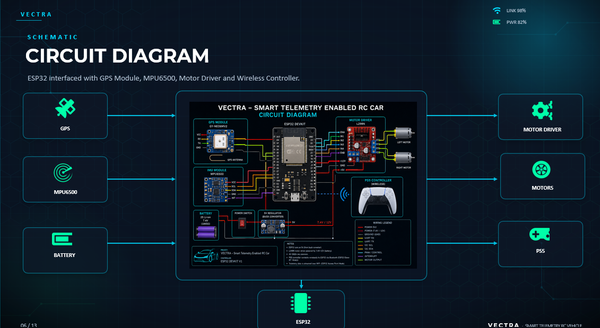

# VECTRA - Smart Telemetry RC Vehicle

**Vehicle Enabled with Connected Telemetry & Real-Time Analytics**

<div align="center">


*A cutting-edge remote-controlled vehicle with real-time GPS tracking, motion sensing, and wireless telemetry dashboard*

[Features](#-features) • [Hardware](#-hardware-specifications) • [Setup](#-getting-started) • [Dashboard](#-live-telemetry-dashboard) • [Roadmap](#-roadmap)

</div>

---

## 🎯 Project Overview

VECTRA is a smart telemetry-enabled remote-controlled vehicle built as a final project for the **Electronic Design Carnival (EDC)** at IIIT Delhi. It transforms traditional RC platforms into intelligent, data-rich systems that provide real-time feedback on vehicle position, orientation, speed, and environmental conditions.

### The Problem We Solved

Traditional RC vehicles operate as one-way systems: commands go out, but no useful data comes back. This creates critical operational risks in field testing:

- **Beyond Visual Line-of-Sight**: Vehicles disappear without position tracking
- **No Crash Evidence**: No post-failure diagnostics for rollovers or impacts
- **Unreproducible Testing**: Runs cannot be logged or compared for tuning
- **No Geofencing**: Vehicles can drift outside safe boundaries undetected

### Our Solution

VECTRA integrates wireless control, motion sensors, GPS, and a live web-based telemetry dashboard to create a complete feedback loop between operator and vehicle.

---

## ✨ Features

### 🎮 Dual Control Modes
- **PS5 DualSense Controller**: Low-latency wireless control with analog throttle, steering, and braking
- **Precision Motor Control**: Differential drive with variable speed PWM control
- **Creep Mode**: Low-speed precision maneuvering
- **Active Braking**: L2 trigger-based proportional braking system

### 📡 Real-Time Telemetry
- **Live GPS Tracking**: Latitude, longitude, altitude, speed, and heading
- **6-Axis IMU**: 3-axis accelerometer + 3-axis gyroscope (MPU6500)
- **Compass Heading**: Real-time direction visualization
- **Satellite Status**: GPS fix quality monitoring
- **WebSocket Streaming**: Low-latency data transmission to web dashboard

### 🌐 Web Dashboard
- **Responsive Design**: Works on desktop, tablet, and mobile
- **Real-Time Visualization**: Live compass, speed, altitude displays
- **Raw Data Stream**: Complete sensor data logging
- **Auto-Reconnection**: Seamless connection recovery
- **Zero-Dependency**: Runs entirely on ESP32 Access Point (no internet required)

### ⚡ Technical Excellence
- **ESP32 Processing Hub**: Dual-core microcontroller managing all subsystems
- **WiFi Access Point**: Self-contained network (SSID: RC_CAR_ESP32)
- **Multi-Protocol Communication**: HTTP, WebSocket, and TCP streaming
- **Efficient Code**: HTML dashboard stored in PROGMEM to minimize RAM usage
- **1Hz Sensor Update Rate**: Optimal balance between responsiveness and stability

---

## 🛠️ Hardware Specifications

### Core Components

| Component | Model | Purpose |
|-----------|-------|---------|
| **Microcontroller** | ESP32 | Central processing, WiFi, motor control |
| **IMU Sensor** | MPU6500 | 6-axis motion sensing (accel + gyro) |
| **GPS Module** | GY-NEO6MV2 | Global positioning, speed, heading |
| **Motor Driver** | L298N | Dual H-bridge for DC motor control |
| **Controller** | PS5 DualSense | Wireless input device |
| **Power** | Li-ion Battery | Portable power supply |
| **Chassis** | Custom | Structural frame with wheels |

### Pin Configuration

#### ESP32 Pin Assignments
```
Motor Control:
- enableRightMotor: GPIO 22
- rightMotorPin1:   GPIO 27
- rightMotorPin2:   GPIO 26
- enableLeftMotor:  GPIO 23
- leftMotorPin1:    GPIO 18
- leftMotorPin2:    GPIO 19

I2C (MPU6500):
- SDA: GPIO 21
- SCL: GPIO 25

UART2 (GPS):
- RX:  GPIO 16
- TX:  GPIO 17
```

### System Architecture

```
┌─────────────────────────────────────────────────────────────┐
│                     VECTRA SYSTEM ARCHITECTURE               │
├─────────────────────────────────────────────────────────────┤
│                                                              │
│  ┌──────────────┐         ┌──────────────┐                 │
│  │ PS5 Controller│────────▶│   ESP32      │                 │
│  │ (Bluetooth)  │  WiFi   │  Processing  │                 │
│  └──────────────┘         └──────┬───────┘                 │
│                                  │                          │
│                    ┌─────────────┼─────────────┐           │
│                    ▼             ▼             ▼           │
│            ┌───────────┐  ┌───────────┐  ┌───────────┐    │
│            │  L298N    │  │  MPU6500  │  │   GPS     │    │
│            │  Driver   │  │   IMU     │  │  Module   │    │
│            └─────┬─────┘  └───────────┘  └───────────┘    │
│                  │                                        │
│            ┌─────┴─────┐                                   │
│            │   Motors  │                                   │
│            └───────────┘                                   │
│                                                              │
│  ┌──────────────────────────────────────────────────────┐  │
│  │           WiFi Access Point (192.168.4.1)           │  │
│  │  ┌─────────────┐  ┌─────────────┐  ┌─────────────┐  │  │
│  │  │ HTTP Server │  │  WebSocket  │  │ TCP Stream  │  │  │
│  │  │  (Port 80)  │  │  (Port 81)  │  │ (Port 8080) │  │  │
│  │  └─────────────┘  └─────────────┘  └─────────────┘  │  │
│  └──────────────────────────────────────────────────────┘  │
│                              │                               │
│                              ▼                               │
│                    ┌─────────────────┐                       │
│                    │ Web Dashboard   │                       │
│                    │ (Browser View)  │                       │
│                    └─────────────────┘                       │
└─────────────────────────────────────────────────────────────┘
```

---

## 🚀 Getting Started

### Prerequisites

- Arduino IDE 2.0+
- ESP32 Board Support Package
- Required Libraries:
  - `ps5Controller`
  - `TinyGPSPlus`
  - `Wire` (built-in)
  - `MPU6050`
  - `WiFi` (built-in)
  - `WebServer` (built-in)
  - `WebSocketsServer`

### Installation

1. **Clone the Repository**
   ```bash
   git clone https://github.com/yourusername/VECTRA.git
   cd VECTRA
   ```

2. **Install Arduino Libraries**
   - Open Arduino IDE
   - Go to Sketch → Include Library → Manage Libraries
   - Search and install:
     - "PS5 Controller"
     - "TinyGPSPlus"
     - "MPU6050"
     - "WebSockets"

3. **Configure Hardware**
   - Connect all components according to the pin configuration
   - Update PS5 controller MAC address in code (line with `ps5.begin()`)
   - Ensure proper power supply (minimum 2A for motors)

4. **Upload Code**
   - Open `src/vectra_telemetry.ino` in Arduino IDE
   - Select ESP32 board from Tools → Board
   - Select correct COM port
   - Click Upload

5. **Connect to Dashboard**
   - Power on VECTRA
   - Connect your device to WiFi network "RC_CAR_ESP32" (password: rccar1234)
   - Open browser and navigate to `http://192.168.4.1`
   - Click "Connect" to view live telemetry

### PS5 Controller Pairing

1. Put PS5 controller in pairing mode (hold PS + Share buttons)
2. Update the MAC address in the code:
   ```cpp
   ps5.begin("YOUR_CONTROLLER_MAC_ADDRESS");
   ```
3. Upload and power cycle ESP32
4. Controller should auto-connect on boot

---

## 📊 Live Telemetry Dashboard

The web dashboard provides real-time visualization of all vehicle telemetry:

### Dashboard Features

- **Status Bar**: Connection indicator with live pulse animation
- **Speed Display**: Real-time speed in km/h from GPS
- **Altitude**: GPS-derived altitude in meters
- **Compass**: Visual compass with needle rotation and cardinal directions
- **GPS Fix Panel**: Latitude, longitude, UTC time, satellite count
- **Accelerometer**: 3-axis acceleration with visual bar graphs
- **Gyroscope**: 3-axis angular velocity with visual bar graphs
- **Raw Stream**: Complete data log for debugging

### Connection Details

- **HTTP Server**: Port 80 (dashboard page)
- **WebSocket Server**: Port 81 (real-time data)
- **TCP Stream**: Port 8080 (raw telemetry for PuTTY/telnet)
- **Default IP**: 192.168.4.1

---

## 🧪 Testing & Calibration

### GPS Testing

1. Outdoor testing required for GPS fix
2. Wait 30-60 seconds for satellite acquisition
3. Minimum 4 satellites for 3D fix
4. Check dashboard for "SAT" badge turning green

### IMU Calibration

1. Place vehicle on flat surface during startup
2. MPU6500 auto-calibrates on power-up
3. Verify accelerometer Z-axis reads ~16384 (1g)
4. Gyro should read near 0 when stationary

### Motor Testing

1. Disconnect wheels for initial testing
2. Use creep mode (no R2 trigger) for low-speed testing
3. Verify forward/reverse directions
4. Test steering differential
5. Reconnect wheels after validation

---

## 📈 Performance Specifications

| Metric | Value |
|--------|-------|
| **Update Rate** | 1 Hz sensor data |
| **WiFi Range** | ~50m (typical indoor) |
| **GPS Accuracy** | ±2.5m (typical) |
| **Max Speed** | Configurable via PWM |
| **Battery Life** | ~2-3 hours (continuous use) |
| **Latency** | <50ms (controller to motor) |
| **Dashboard Update** | Real-time via WebSocket |

---

## 🗺️ Roadmap

### Phase 1: Foundation ✅ (Completed)
- [x] PS5 controller integration
- [x] GPS tracking implementation
- [x] IMU sensor fusion
- [x] Web dashboard development
- [x] WiFi telemetry streaming

### Phase 2: Enhancement (In Progress)
- [ ] Data logging to SD card
- [ ] Geofencing with automatic braking
- [ ] Over-the-air (OTA) updates
- [ ] Mobile app development
- [ ] Autonomous waypoint navigation

### Phase 3: Advanced Features
- [ ] Computer vision integration
- [ ] Obstacle detection and avoidance
- [ ] Swarm communication (multi-vehicle)
- [ ] Cloud telemetry aggregation
- [ ] Machine learning for terrain adaptation

### Phase 4: Production
- [ ] Custom PCB design
- [ ] Enclosure and weatherproofing
- [ ] Manufacturing optimization
- [ ] Certification and compliance
- [ ] Commercial deployment

---

## 👥 Team & Acknowledgments

### Development Team
- **Anshika Dhiman** - Hardware Integration & Testing
- **Nimish Rai** - Software Development & Dashboard
- **Anurag** - System Architecture & Motor Control

### Special Thanks

**Faculty Guidance**
- **Prof. Anuj Grover** - Head of Department, IIIT Delhi
  - Motivation for intelligent product design
  - Guidance on system architecture
  - Appreciation and support throughout the project

**Event Organization**
- **Rahul Gupta** - Electronic Design Carnival (EDC) Coordinator
  - Event organization and logistics
  - Technical support and resources

**Technical Mentorship**
- **Abbas Murtaza** - Technical Guide
  - Hardware design guidance
  - Sensor integration support
  - Debugging and optimization assistance

---

## 📄 License

This project is licensed under the MIT License - see the [LICENSE](LICENSE) file for details.

```
MIT License

Copyright (c) 2026 VECTRA Team

Permission is hereby granted, free of charge, to any person obtaining a copy
of this software and associated documentation files (the "Software"), to deal
in the Software without restriction, including without limitation the rights
to use, copy, modify, merge, publish, distribute, sublicense, and/or sell
copies of the Software, and to permit persons to whom the Software is
furnished to do so, subject to the following conditions:

The above copyright notice and this permission notice shall be included in all
copies or substantial portions of the Software.

THE SOFTWARE IS PROVIDED "AS IS", WITHOUT WARRANTY OF ANY KIND, EXPRESS OR
IMPLIED, INCLUDING BUT NOT LIMITED TO THE WARRANTIES OF MERCHANTABILITY,
FITNESS FOR A PARTICULAR PURPOSE AND NONINFRINGEMENT. IN NO EVENT SHALL THE
AUTHORS OR COPYRIGHT HOLDERS BE LIABLE FOR ANY CLAIM, DAMAGES OR OTHER
LIABILITY, WHETHER IN AN ACTION OF CONTRACT, TORT OR OTHERWISE, ARISING FROM,
OUT OF OR IN CONNECTION WITH THE SOFTWARE OR THE USE OR OTHER DEALINGS IN THE
SOFTWARE.
```

---

## 🤝 Contributing

We welcome contributions to VECTRA! Please follow these guidelines:

1. Fork the repository
2. Create a feature branch (`git checkout -b feature/AmazingFeature`)
3. Commit your changes (`git commit -m 'Add some AmazingFeature'`)
4. Push to the branch (`git push origin feature/AmazingFeature`)
5. Open a Pull Request

### Development Guidelines
- Follow Arduino coding conventions
- Add comments for complex logic
- Update documentation for new features
- Test hardware changes thoroughly

---

## 📞 Contact & Support

- **Project Repository**: [GitHub](https://github.com/yourusername/VECTRA)
- **Issues**: [GitHub Issues](https://github.com/yourusername/VECTRA/issues)
- **Discussions**: [GitHub Discussions](https://github.com/yourusername/VECTRA/discussions)

---

## 📸 Gallery

### Product Images

#### Telemetry Dashboard


#### Hardware Assembly


#### Schematics and Wiring Diagram
)

---


<div align="center">

**Built with ❤️ by the VECTRA Team (Nimish, Anurag, and Anshika)**

*Transforming RC vehicles into intelligent, data-driven systems*

[⬆ Back to Top](#vectra---smart-telemetry-rc-vehicle)

</div>
